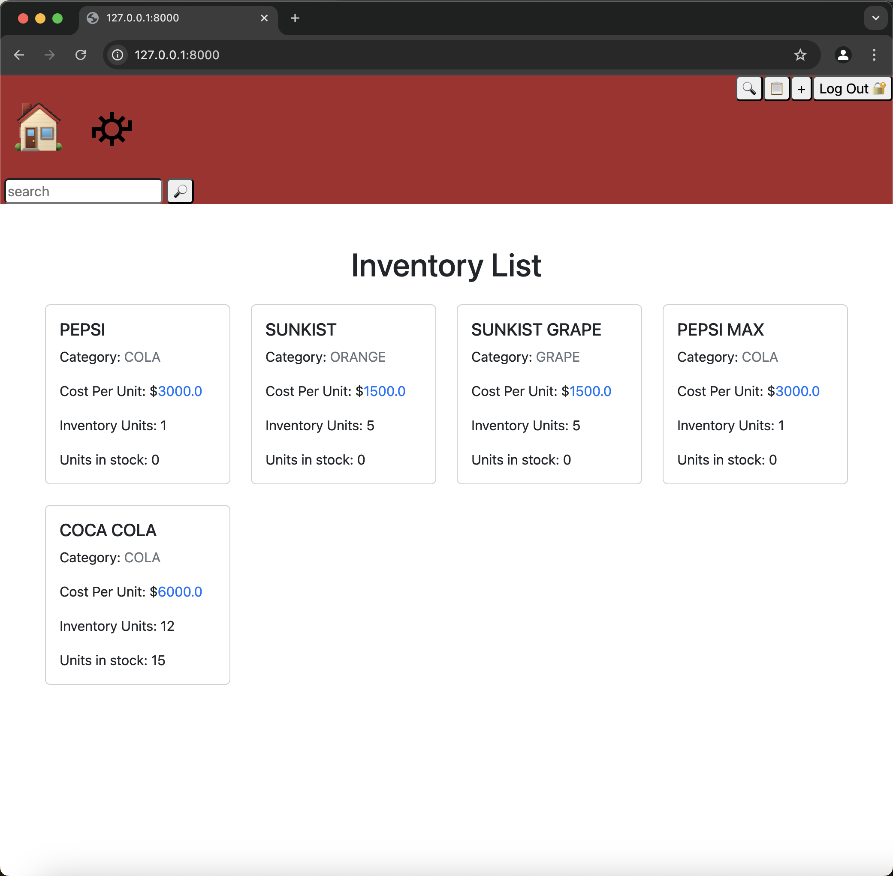

# **Capstone Inventory**



## **Overview**

I work in the Quality Control department at a Pepsi plant, where I manage concentrate inventory. Since this isn't a corporate plant, we handle multiple brands, each with unique tracking requirements, making inventory management complex.

For my CS50W Capstone project, I developed a **concentrate inventory system** tailored to our facility's specific needs. This application organizes inventory by flavor, tracking **cost per unit, stock levels, and smallest unit size**. By streamlining inventory tracking, it enhances accuracy and accessibility for everyday use.

**I hope You enjoy my capstone project it took forever to make!**

---
## Distinctiveness and Complexity

This project is distinct from previous CS50W projects in several key ways. While the sample projects from the course—such as *Mail*, *Network*, and *Commerce*—focus primarily on general web application themes like messaging systems, auctions, and social interactions, this capstone project introduces a completely different domain: business inventory management tailored specifically for use in a soda production facility. The nature of this web app serves a niche, real-world business need, setting it apart not only in function but also in structure, scalability, and data sensitivity.

### How It Differs from Prior Projects

| Feature              | CS50W Sample Projects (Mail, Network, Commerce) | Capstone Inventory Project                          |
|----------------------|--------------------------------------------------|-----------------------------------------------------|
| Purpose              | Social networking, auctions, messaging           | Business inventory management                       |
| Core Functionality   | User interaction, messaging, bidding             | Stock tracking, real-time updates, category filtering |
| User Roles           | General public interaction                       | Restricted to authorized personnel                  |
| Data Structure       | Simple models (e.g., posts, messages)            | Complex models with interrelated inventory components |
| Asynchronous Updates | Minimal (e.g., AJAX for likes)                   | Extensive AJAX usage for live inventory updates     |

Unlike the projects in the course which are often open to any user and focus on community or engagement, this application is limited strictly to internal users—authorized employees and managers within the soda plant. It was designed with business logic in mind rather than public-facing social features. Every action within the application has practical consequences in a real production environment, making both data accuracy and access control critically important.

The application's **core functionality** revolves around inventory movement tracking, live quantity adjustments, and product classification. These features are not only more complex in nature but are deeply interconnected—unlike the isolated components seen in simpler projects like *Mail* or *Network*. Additionally, this project introduces the concept of **role-based access** and **authentication control**, ensuring that only specific personnel can perform sensitive tasks like updating or deleting stock records. The application handles various product categories and batch data, with carefully managed relationships in the database to prevent data conflicts or integrity issues.

### Why This Project is Complex

This project is technically and logically complex for several reasons. First, it incorporates a **dynamic inventory system** built using Django and JavaScript, utilizing AJAX for real-time updates. This means that users can modify and view inventory changes on-the-fly without needing to reload the entire page. The seamless interactivity between the frontend and backend reflects a strong understanding of asynchronous communication and modern full-stack development.

Second, **security and authentication** are foundational to the project. Since this is an internal business tool, there are strict checks in place to ensure only authorized users can log in and make changes. This layer of access control is implemented via Django's built-in user system with additional customization for roles, adding complexity compared to the open-access designs in other CS50W projects.

Third, the **data relationships** modeled in this application are more advanced than anything covered in the earlier coursework. Products are associated with categories, stock levels, movement logs, and pricing structures. Creating, editing, and displaying this information requires thoughtful model design and efficient use of Django’s ORM (Object-Relational Mapping), as well as understanding database normalization and query optimization.

Fourth, this project is built with **mobile optimization** in mind. Production employees often move around the plant, and having an interface that works seamlessly across desktop and mobile devices allows inventory to be managed on the go. CSS media queries, responsive layouts, and touch-friendly controls were all considered during the front-end development.

Finally, this project solves a **real-world problem**—not just an academic or social one. In fast-paced environments like soda plants, where raw materials and products are constantly moving in and out, losing track of inventory can lead to costly mistakes. This web app provides an intuitive, centralized platform for monitoring and controlling those movements. Its design is simple enough for daily use, yet robust enough to scale as plant operations grow.

Unlike typical CS50W projects, which focus on user engagement and social features, this project is a real-world business application designed to solve an industry-specific challenge. This app caters to production facilities. With a lot of product moving in and out of a soda plant daily, I feel that my web application can help keep track of everything in a simple and accessible way, reducing errors and improving operational efficiency.
---

## **Technical Details**

The project is built with **Django** and follows a structured approach:

### **Backend Features:**

- **Models:**
  - `Flavor` – Stores details like name, category, cost per unit, and stock levels.
  - `InStock` – Manages inventory and dynamically updates stock.

- **Security:**
  - User authentication ensures only authorized personnel can view or modify inventory.

### **Frontend & Interactivity:**

- Bootstrap and custom CSS for a professional UI.
- JavaScript and AJAX enable real-time updates without page reloads.

---

## **Project Structure**  

### **Root Directory**  
- **`manage.py`** – The Django command-line utility for managing the project (e.g., running the server, migrations, etc.).  
- **`requirements.txt`** – Lists dependencies required to run the project.  
- **`db.sqlite3`** – SQLite database file for storing application data.  

---

## **Main Django Application (`capstone/`)**  

### **`settings.py`**  
Contains Django settings, including:  
- Database configuration (SQLite)  
- Installed apps (`inventory`, `admin`, `auth`, etc.)  
- Middleware settings  
- Static and media file settings  

### **`urls.py`**  
Defines the main URL routing for the project, connecting the root URLs to the `inventory` app.

---

## **Inventory App (`inventory/`)**  

### **`models.py`**  
Defines the database structure using Django ORM.  

#### **Models:**
1. **`Category`** – Represents different concentrate categories.  
   - `name (CharField)` – Stores the category name.  
   - `__str__()` – Returns the category name as a string.  

2. **`Flavor`** – Stores different flavors.  
   - `name (CharField)` – Stores the name of the flavor.  
   - `category (ForeignKey to Category)` – Links each flavor to a category.  
   - `description (TextField)` – Additional details about the flavor.  
   - `created_at (DateTimeField)` – Automatically saves the timestamp when the flavor is added.  
   - `__str__()` – Returns the flavor name.  

3. **`InStock`** – Tracks available stock for each flavor.  
   - `flavor (ForeignKey to Flavor)` – Links stock to a specific flavor.  
   - `quantity (IntegerField)` – The amount of stock available.  
   - `last_updated (DateTimeField)` – Automatically updates when stock changes.  
   - `__str__()` – Returns the stock level for the flavor.  

---

### **`views.py`**  
Handles user requests and returns responses.  

#### **Views (Functions in `views.py`):**  

1. **`index(request)`**  
   - Fetches all flavors and their stock levels.  
   - Renders the `index.html` template to display inventory.  

2. **`new_flavor(request)`**  
   - Handles adding a new flavor.  
   - If `POST`: Validates form data, saves the new flavor, and redirects.  
   - If `GET`: Displays an empty form.  
   - Uses the `FlavorForm` from `forms.py`.  

3. **`edit_flavor(request, id)`**  
   - Allows users to edit an existing flavor.  
   - Retrieves the `Flavor` object by `id`, pre-fills a form, and updates the database if submitted.  

4. **`search(request)`**  
   - Implements a search feature to find flavors by name.  
   - Filters flavors based on the search query.  

---

### **`forms.py`**  
Contains Django forms for handling user input.  

#### **Forms:**
1. **`FlavorForm`**  
   - A Django `ModelForm` for creating or updating flavors.  
   - Includes fields: `name`, `category`, and `description`.  

---

### **`admin.py`**  
Registers models for Django’s admin interface.  
```python
from django.contrib import admin
from .models import Category, Flavor, InStock

admin.site.register(Category)
admin.site.register(Flavor)
admin.site.register(InStock)
```
- This allows admins to manage categories, flavors, and stock from the Django admin dashboard.  

---

### **`urls.py`** (Inside `inventory/`)  
Defines URL patterns for the `inventory` app.  
```python
urlpatterns = [
    path("", views.index, name="index"),
    path("new/", views.new_flavor, name="new_flavor"),
    path("edit/<int:id>/", views.edit_flavor, name="edit_flavor"),
    path("search/", views.search, name="search"),
]
```
- **`""` → `index()`** (Main inventory view).  
- **`new/` → `new_flavor()`** (Add a new flavor).  
- **`edit/<id>/` → `edit_flavor()`** (Edit existing flavors).  
- **`search/` → `search()`** (Search flavors).  

---

## **Templates (`inventory/templates/inventory/`)**  
Contains HTML templates using Django's template engine.  

1. **`index.html`**  
   - Displays a list of all flavors and their stock.  
   - Contains links to add new flavors and edit existing ones.  

2. **`newf.html`**  
   - Form for adding a new flavor.  

3. **`edit.html`**  
   - Edit page for flavors.  

4. **`search.html`**  
   - Displays search results.  

---

## **Static Files (`inventory/static/inventory/`)**  
Contains static files for styling and interactivity.  

- **`styles.css`** – CSS for layout and design.  
- **`script.js`** – JavaScript for interactive elements.  

---


## **Installation Instructions**  

1. **Clone the Repository:**  
   ```bash
   git clone https://github.com/me50/pimpy6565/tree/f63c9734b743182bdb5a0ea0d11d0a108a8eeae8
   cd capstone-inventory
   ```
2. **Install Dependencies:**  
   ```bash
   pip install -r requirements.txt
   ```
3. **Set Up the Database:**  
   ```bash
   python manage.py makemigrations
   python manage.py migrate
   ```
4. **Run the Development Server:**  
   ```bash
   python manage.py runserver
   ```
5. **Access the App:**  
   - Open your browser and visit `http://127.0.0.1:8000`  

---

## **How to Use**  

### **1. Log In or Register**  
- Open the app in a browser.  
- New users can register; existing users log in.  

### **2. Add a Product**  
- Navigate to "Add Product."  
- Enter details (name, category, unit count, price).  
- Click "Save."  

### **3. View Inventory**  
- Browse all products.  
- Use the search bar to find specific items.  

### **4. Update Product Details**  
- Click "Edit" next to an item.  
- Modify details and save changes.  

### **5. Delete a Product**  
- Click "Delete" next to an item and confirm.  

### **6. Track Categories & Pricing**  
- View products by category.  
- Analyze total inventory value.  

### **7. Log Out**  
- Click "Logout" in the top-right corner.  

---

## **What Makes This Project Unique?**  

✅ **Designed for a Real Business Use Case**  
- Tracks soda concentrate inventory efficiently.  

✅ **Enhanced User Experience**  
- Real-time updates & intuitive UI.  

✅ **Distinct from Standard CS50W Projects**  
- Not a social media or auction platform—**it solves a real-world problem**.  

---

## **Conclusion**  

This **capstone project** showcases my ability to build **practical web applications** using **Django, JavaScript, and Bootstrap**. By focusing on inventory management for soda production, it highlights my technical skills and problem-solving approach.  

The **mobile-friendly interface, real-time updates, and business-specific features** demonstrate how web development can be used to solve **real-world challenges**.  

---

## **Video Demo**  
[Watch Here](https://youtu.be/kSeDQca5mZI?si=Ija_fS9jGL3-XJcw)  